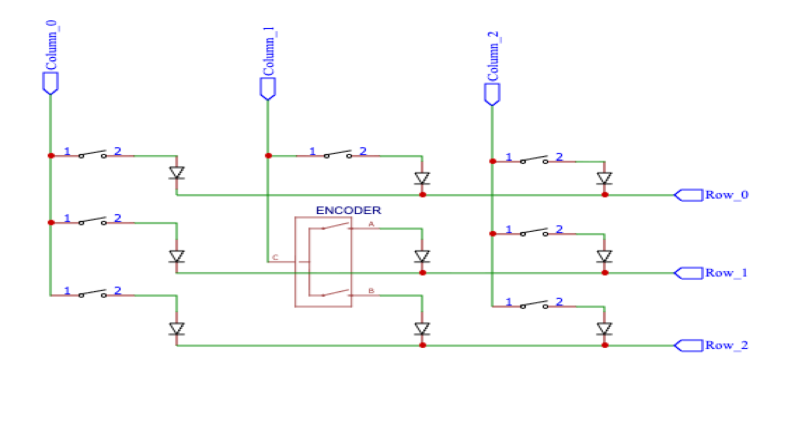
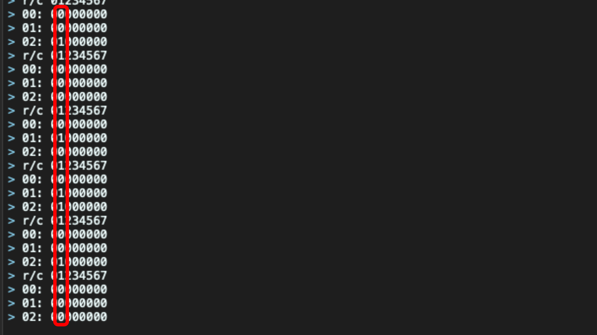

# Encoders in matrix

This module helps when you are pin constrained but still need to add more encoders to your build. Instead of wasting precious pins for direct encoder connection, put them in your key matrix like ordinary keys and enjoy nearly unlimited number of encoders on your build.

## How to use
You can find [full example source here.](https://github.com/EverydayErgo/qmk_modules/tree/main/encoders_in_matrix/src)

First you need to have you encoders properly wired into your key/switch matrix. 

**Common pin C** is wired to your **Column_X**

**Pin A** goes to **Row_X**

**Pin B** goes to **Row_Y**

In fact an encoder is just a switch that's switching between A/B output. Remember to have diodes as well, just like for a normal switch.

In your layout put **KC_NO** at the location where **Pin A** and **Pin B** are connected to the matrix.
```C
  const uint16_t PROGMEM keymaps[][MATRIX_ROWS][MATRIX_COLS] = {
      [0] = LAYOUT_ortho_3x3(
          KC_A,    KC_B,    KC_C,
          KC_D,    KC_NO,   KC_F,
          KC_G,    KC_NO,   KC_I
      )
  };
```
Next you have to figure out the position of these pins. Easiest way is to just read the **keymap.json** file.
```JSON
  "layouts": {
          "LAYOUT_ortho_3x3": {
              "layout": [
                  {"matrix": [0, 0], "x": 0, "y": 0},
                  {"matrix": [0, 1], "x": 1, "y": 0},
                  {"matrix": [0, 2], "x": 2, "y": 0},
                  {"matrix": [1, 0], "x": 0, "y": 1},
                  {"matrix": [1, 1], "x": 1, "y": 1},
                  {"matrix": [1, 2], "x": 2, "y": 1},
                  {"matrix": [2, 0], "x": 0, "y": 2},
                  {"matrix": [2, 1], "x": 1, "y": 2},
                  {"matrix": [2, 2], "x": 2, "y": 2}
              ]
          }
      }
```
**Pin A** is **Row/Col** [1, 1]

**Pin B** is **Row/Col** [2, 1]

If you don't have a valid json file for your keyboard you can use **QMK Toolbox** and debug via HID Console. To do that just enable [console and debugging.](https://docs.qmk.fm/faq_debug)


Drop a **keymap.json** file where your layout is located and include this module. [Read more about community modules.](https://docs.qmk.fm/features/community_modules)
Or check my [How to.](https://github.com/EverydayErgo/qmk_modules)

Include this module in your **keymap.json** file.
```JSON
    {
        "module" : ["everydayergo/encoders_in_matrix"]
    }
```
Next step is to define encoder "names", this way it will be easier later on to process them. Format is:
```C
  EIM_ENCODER_NAMES(Name1, Name2, ...)
```
In our case:

```C
  EIM_ENCODER_NAMES(ENC_IN_MATRIX)
```
Once this step is done, you can begin defining the mapping. In order to define the mapping you can use these macros.
```C
EIM_ENCODERS_BEGIN 
  EIM_ENC(name,  pad_a, pad_b)  
  EIM_ENCR(name, pad_a, pad_b, resolution) //custom resolution
  EIM_ENCF(name, pad_a, pad_b)  //flipped
  EIM_ENCRF(name, pad_a, pad_b, resolution) //custom resolution and flipped
EIM_ENCODERS_END 
```
You can also flip direction by swapping **PADA** with **PADB**.
**PADA/PADB** macro has such format:
```C
  EIM_PADA(row, column) 
  EIM_PADB(row, column) 
```

For our example it will be just short.
```C
  EIM_ENCODERS_BEGIN
    EIM_ENC(ENC_IN_MATRIX, EIM_PADA(1, 1), EIM_PADB(2, 1))
  EIM_ENCODERS_END
```
Lastly you have to handle messages coming from encoders. Implement callback like this.
```C
void encoders_in_matrix_update_user(enc_names_t encoder, bool clockwise) {
    switch(encoder) {
      case ENC_IN_MATRIX:
        if(clockwise)
          tap_code(KC_UP);
        else
          tap_code(KC_DOWN);
        break;
        default:  //required
        break;
    }
}
```
You can define resolution per encoder in mapping, but you can also redefine default global resolution, for example **32**. Default is **2**.
```C
  #undef EIM_DEFAULT_RESOLUTION
  #define EIM_DEFAULT_RESOLUTION 32
```
This needs to be done before
```C
  EIM_ENCODERS_BEGIN
```
