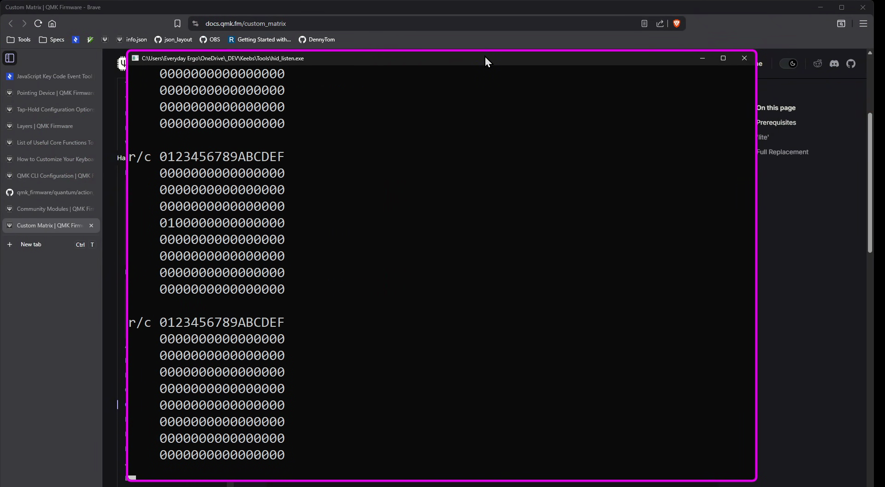

# OS Aware keys 
  Set of unified keys and functionalities to make moving between operating system easy. Use one key to yield the same functionality. For example **Zoom In** has different shortcut for Windows and MacOS.
  |Shortcut|Windows|MacOS|
  |--------|-------|-----|
  |Zoom In |Ctrl + |Command +|
  
  Additionally this modules includes mouse related features. OS aware scrolling, no more inverted scroll on Mac when moving from Windows. Scrolling can also be done with pointing device by using designated key code or by selecting physical key on the keyboard matrix that will trigger the scroll. This helps in situations when you would like to have scroll implemented when on particular layer but would like to skip the Tap delay so that mouse cursor won't move.

## How to use
Include this module in your **keymap.json** file.
```JSON
  {
      "module" : ["everydayergo/osa_keys"]
  }
```

## Default features
By default based on the operating system type 
```C
  KC_LGUI
```
will be swapped with
```C
  KC_LCTL
```
Basically **Control** will be swapped with **Command/Win**. This also applies to **Mod-Tap** and **One Shot Keys**.

Same applies to **MS_WH\*** keys, responsible for scrolling. Module handles these keycodes and applies OS aware direction scrolling, this means no more reversed scrolling on MacOS compared to Windows.

## Overrides 
In case operating system wasn't detected properly it can be overridden by using built in functions.
```C
  void force_macos(void);
  void force_windows(void);
```
For example via use of **Leader Key** 

```C
void leader_end_user(void) {
  if (leader_sequence_two_keys(KC_F, KC_M)) {
    force_macos();
  }else if (leader_sequence_two_keys(KC_F, KC_W)) {
    force_windows();
  }
}
```
## Key/Pointing device scrolling
There are two methods to scroll exposed by this module.
1. By using exposed keys - put any of the scroll related keys from the table below in your keymap just like any other key. When pressed it will output OS proper scroll event. Works best with rotary encodes, i.e. [MEH-01](https://github.com/EverydayErgo/MEH01)
2. By using pointing device (trackball, touchpad etc.) if your keyboard is equipped with one. Two methods available here: 
   * **Scroll keys**  
      * for vertical scroll with pointing device put somewhere in your layout:
      ```C
        OA_PDSV
      ```
      * for horizontal scroll with pointing device put somewhere in your layout:
      ```C
        OA_PDSH
      ```
      Now holding that key will trigger scrolling with pointing device.

   * **Keyboard Matrix** - You will have to provide at least one pair of row/column values. Depending on which type of scroll is of interest to you. You can use both and even module pre-defines keys for scrolling at the same time.
    ```C
      #define PDS_VERTICAL_SCROLL_ROW 3
      #define PDS_VERTICAL_SCROLL_COLUMN 0

      #define PDS_HORIZONTAL_SCROLL_ROW 3
      #define PDS_HORIZONTAL_SCROLL_COLUMN 1
    ```
    These can be taken from **matrix debug output**, or from your **keyboard.json**. You will have to provide physical location of the key that will trigger desired scroll. Benefit of such approach is that you can use Mod-Tap keys/layers without being affected by mod-tap delay. As soon as the key is physically pressed the scroll will trigger. Any other approach will include the wait time for the tap-term to expire which will cause the mouse cursor to move slightly before the scroll kicks in and locks mouse movement.
    In order to get the values from **matrix debug output** follow these steps:
      * To your ***keyboard_name.c*** or **keymap.c** add:
      ```C
      void keyboard_post_init_user(void) {
        debug_enable=true;
        debug_matrix=true;
      }
      ```
    * Enable console output in your **keyboard.json/features** by adding:
    ```JSON
        "features": {
            "console": true,
        },    
    ```
    * You can use [QMK Toolbox](https://qmk.fm/toolbox) or [HID_Listen](https://www.pjrc.com/teensy/hid_listen.html) to read debug output from the keyboard.
    
    Press the desired key and read the row/column pair from the debug output where '1' shows up. This is very similar to [QMK Bootmagic](https://docs.qmk.fm/features/bootmagic). Now no matter what function is assigned to that key (except maybe for enter DFU mode) whenever it's pressed it will trigger scroll with pointing device.

## Keys
List of available keys with equivalent shortcuts.
|OSA Key|Windows      |MacOS            |Description                    |
|-------|---------------|---------------|-------------------------------|
|OA_VDL |Win+Ctrl+Left  |Control+Left   |Virtual desktop/Workspace Left |
|OA_VDR |Win+Ctrl+Right |Control+Right  |Virtual desktop/Workspace Right|
|OA_APQT|Alt+F4         |Command+Q      |Application quit               |
|OA_APPV|Win+Tab        |Control+Up     |App view                       |
|OA_APPW|               |Control+Down   |App windows                    |
|OA_WBAK|Back           |Command+[      |Web back                       |
|OA_WFWD|Forward        |Command+]      |Web forward                    |
|OA_WREF|F5             |Command+R      |Web refresh                    |
|OA_ZOIN|Ctrl +         |Command +      |Zoom in                        |
|OA_ZOUT|Ctrl -         |Command -      |Zoom out                       |
|OA_ZORT|Ctrl+0         |Command+0      |Zoom reset (100%)              |
|OA_PDSV|Scroll Vertical|Scroll Vertical|Hold key to scroll with pointing device vertical|
|OA_PDSH|Scroll Horizontal|Scroll Horizontal|Hold key to scroll with pointing device horizontal|